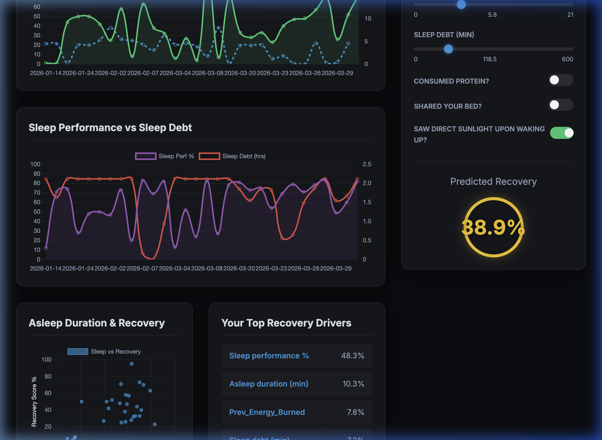
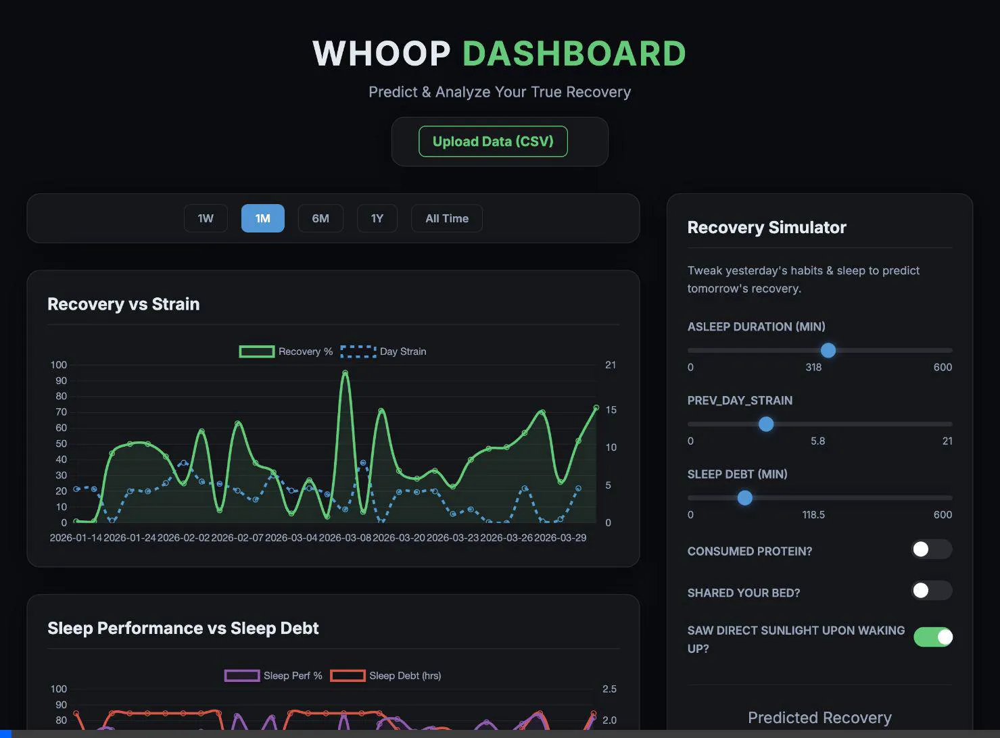

# Whoop Recovery Simulator Dashboard

A custom, sleek, and highly interactive web dashboard built to visualize and analyze physiological Whoop Data using Machine Learning.

## Overview
This project processes your exported Whoop data (`physiological_cycles.csv`, `sleeps.csv`, `journal_entries.csv`) and uses a **Random Forest Regressor** to determine precisely which behaviors drive your Recovery Score %, and by how much.

It features a custom-built, dark-mode dashboard (HTML/CSS/JS) served dynamically by a Flask backend. It evaluates your past metrics and allows you to instantly slice the data over custom timeframes (1 Week, 1 Month, All Time) using intuitive UI controls.

## Features
- **Recovery Simulator**: Tweak sliders for sleep duration and toggle daily behaviors (e.g., protein intake, sunlight exposure) to get an instant **Predicted Recovery** score from the ML model on the fly.
- **Top Recovery Drivers**: Extracts and ranks the most impactful behaviors and metrics from your personalized historical data using Random Forest feature importance.
- **Real-Time Data Import**: Securely upload your Whoop CSV dumps straight into the Dashboard interface. The backend will parse the new tabular data, seamlessly replace `NaN` values, instantly retrain the ML model in the background, and push the updated insights back to your screen.
- **Advanced Physiological Charting**: Dynamic multi-axis time-series visualization covering Recovery vs Strain, Sleep Clearance, and deeply correlated Scatter Plots using `Chart.js`.

## Tech Stack
- Frontend: Vanilla JS, CSS (Glassmorphism styling), HTML5, Chart.js
- Backend: Python 3, Flask, scikit-learn, pandas, numpy

## Running Locally
1. Clone the repository
2. Ensure you have activated your python virtual environment
3. Install dependencies: `pip install pandas scikit-learn flask flask-cors`
4. Run the server: `python whoop_ui/app.py`
5. Open your browser to `http://localhost:8080`
